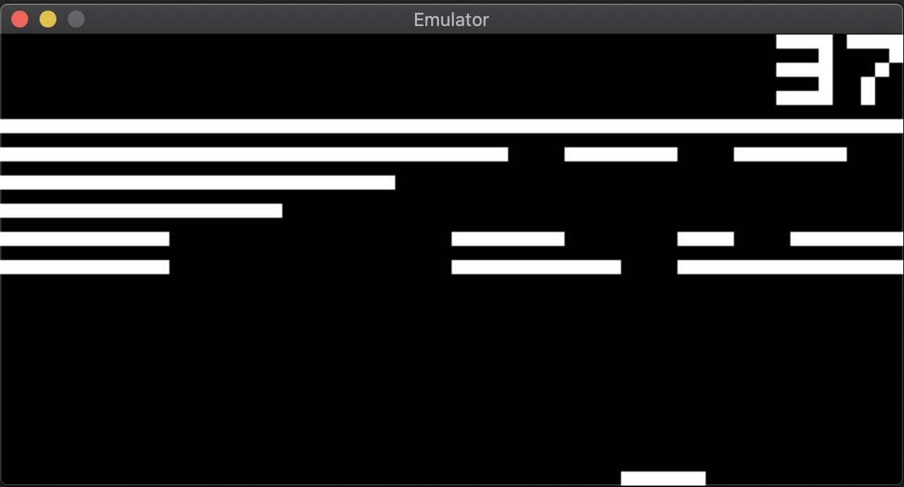
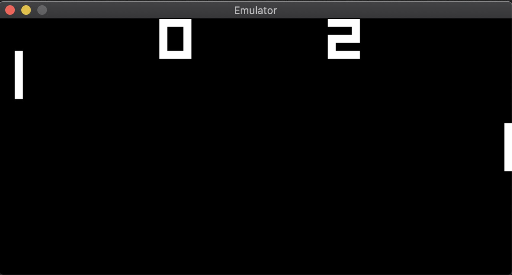

# Chip-8 Emulator #


*Breakout*


*Pong*


## Description ##

A Chip-8 emulator written in C++.
> [Chip-8](https://en.wikipedia.org/wiki/CHIP-8) is an interpreted programming language, developed by Joseph Weisbecker. It was initially used on the COSMAC VIP and Telmac 1800 8-bit microcomputers in the mid-1970s. CHIP-8 programs are run on a CHIP-8 virtual machine. It was made to allow video games to be more easily programmed for these computers, but CHIP 8 is still used today, due to its simplicity, and consequently on any platform and its teaching of programming Binary numbers.

The main motivation for creating this project is to increase familiarity with low-level programming concepts and gain development experience with C++.

## Building, Compiling, and Running ##
Note: This project requires cmake and libsdl2.
### Building and Compiling ###

```
$ mkdir build
$ cd build
$ cmake ..
$ make
```

### Running ###
```
./chip8 <Scale> <Clock Delay> <ROM>
```
`Scale` corresponds to the emulator's window size.

`Clock Delay` represents the clock the emulator should run on (varies depending on ROM - e.g. breakout uses 3, while pong uses 1).

`ROM` is the path to the Chip-8 ROM that the user wants to run.

Example:
```
./chip8 10 3 ../roms/breakout.rom
```

## Keyboard Layout:

### Original Chip8 Keypad:
|   |   |   |   |
|---|---|---|---|
| 1 | 2 | 3 | C |
| 4 | 5 | 6 | D |
| 7 | 8 | 9 | E |
| A | 0 | B | F |

### Emulator Keyboard Mapping:
|   |   |   |   |
|---|---|---|---|
| 1 | 2 | 3 | 4 |
| Q | W | E | R |
| A | S | D | F |
| Z | X | C | V |

## Acknowledgements and References ##
Here are some of the resources I used while working on this emulator:
- https://austinmorlan.com/posts/chip8_emulator/
- http://www.multigesture.net/articles/how-to-write-an-emulator-chip-8-interpreter/
- http://en.wikipedia.org/wiki/CHIP-8
- https://tobiasvl.github.io/blog/write-a-chip-8-emulator/